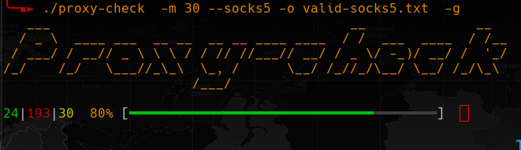

# PROXY-CHECK

Check if proxies are working (http, socks4 & socks5)



### usage:

```
-h, --help                   Show this help
-s, --socks4                 Test socks4 proxies
-S, --socks5                 Test socks5 proxies
-H, --http                   Test http proxies
-r, --randomize-file         Shuffle proxies files
-t, --thread=NBR             Number of threads
-T, --timeout=SEC            Set timeout (seconds)
-u, --url=TARGET             url to test proxies
-f, --proxies-file=FILE      File to check proxy
-m, --max-valid=NBR          Stop when NBR valid proxies are found
-U, --proxies-url=URL        url with proxies file
-g, --github                 use github.com/mmpx12/proxy-list
-o, --output=FILE            File to write valid proxies
-v, --version                Print version and exit
```

Local or remote should be on format: proto://ip:port

 
### Examples:

Only check socks5 proxies from "https://raw.githubusercontent.com/mmpx12/proxy-list/master/proxies.txt" and stop after founding 30 valid proxies.
 
`proxy-check -r -m 30 --socks5 -o valid-socks5.txt  -g`


Check all proxies from "/path/to/proxy" to url "www.urltotest.me" with a timeout f 6 second.

`proxy-check -u www.urltotest.me -T 6 /path/to/proxy`


#### Warnings:

By default this will check to "checkip.amazonaws.com" and some false negative might occurs (timeout, rate limit, flagged ip etc...).

### Install

```sh
git clone https://github.com/mmpx12/proxy-check.git
cd proxy-check
make
sudo make install
# or 
sudo make all
```

for **termux** you can do:

```sh
git clone https://github.com/mmpx12/proxy-check.git
cd proxy-check
make
make termux-install
# or
make termux-all
```


There is also prebuild binaries [here](https://github.com/mmpx12/proxy-check/releases/latest).
